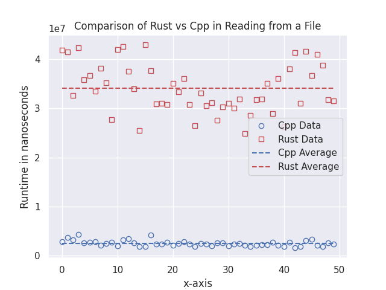
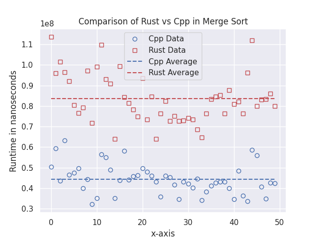
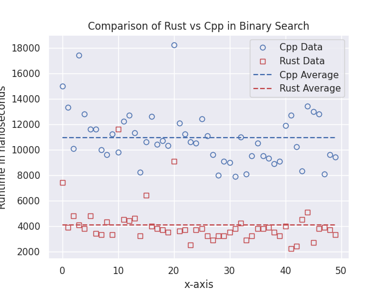
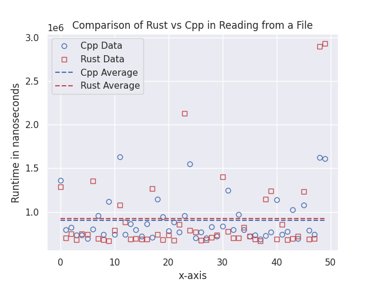
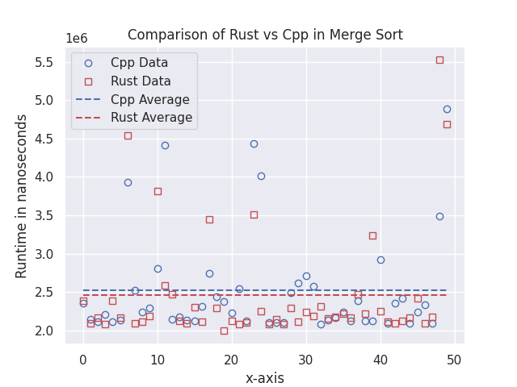
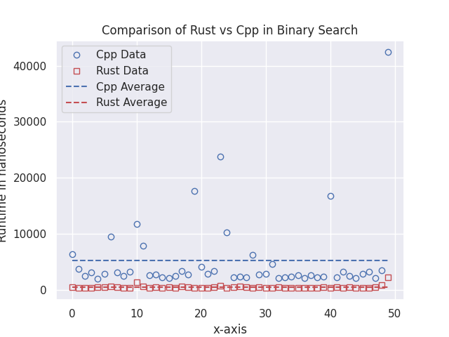

# M3OEP-MPL1-jschnec1

## About
This program is a comparison of the performance of rust and cpp. In it you will find three main files: main.py, main.cpp and main.rs. Main.cpp and main.rs are simple mirrors of one another. They both read from numbers.txt, sort the numbers using merge sort, look for a number using binary search and record the time taken to perform each of these tasks. Main.py is used to run both programs and than plot the resulting data. Main.py also allows the ability to choose the level of optimization the rust and g++ compilers use on their respective targets. For instance, 
```console 
python3 main.py
```
runs the default builds, but 
```console 
python3 main.py arg  
``` 
runs the compilers with highly optimized builds (for cpp its -03, for rust --release). This results in a more apt comparison since rust has a much slower default build. 

## Required to Run
To run this program, you will need the following,

1. Pip install numpy, matplotlib, seaborn
2. Have a terminal shell that runs linux commands
3. Install Rust: https://www.rust-lang.org/

## Video Demonstration
Please lower volume, mic picked up too much at the begining. If you don't I apologize in advance.

https://www.youtube.com/watch?v=XJJABNkvLBQ 
   
## Output
### Non-Optimized Executables



### Optimized Executables




## Resources and References
https://stackoverflow.com/questions/50891632/calculating-time-elapsed-in-c 

http://www.cplusplus.com/forum/general/236273/ 

https://mohitkarekar.com/posts/2020/merge-sort-in-rust/ 